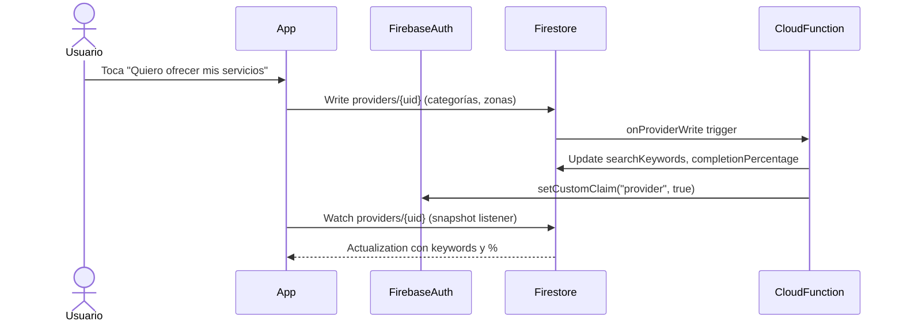
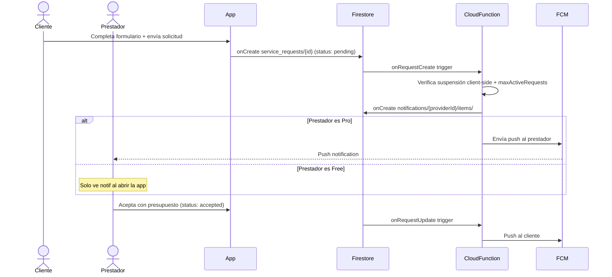

# RFC: ChangaYa

> Marketplace de servicios locales para la provincia de Formosa, Argentina — conecta clientes con prestadores de servicios independientes de forma organizada, confiable y accesible.

**Version**: 0.1.0-draft (MVP)
**Author**: Equipo ChangaYa
**Date**: Marzo 2026
**Status**: Draft
**PRD asociado**: [PRD.md](./PRD.md)

---

> **Qué es este documento:**
> Este RFC (Request for Comments) define el CÓMO técnico del proyecto. Mientras el PRD define QUÉ se construye y PARA QUIÉN, el RFC define CÓMO se construye: arquitectura, stack, diseño técnico, flujos de datos, estrategia de testing, deployment, decisiones técnicas y sus tradeoffs. El RFC es la referencia técnica que los agentes IA y desarrolladores consultan para implementar correctamente.

---

## 1. Resumen (Summary)

ChangaYa es un marketplace two-sided de servicios locales construido sobre **Flutter 3.x + Firebase** (serverless). El cliente Flutter único genera binarios nativos para Android, iOS y Web desde un mismo codebase. El backend es completamente administrado: Firebase Authentication gestiona identidad, Cloud Firestore es la base de datos principal con persistencia offline, Cloud Functions v2 (Node.js 20 + TypeScript) ejecuta toda la lógica sensible del servidor, y FCM distribuye notificaciones push.

El patrón arquitectónico es **Clean Architecture simplificada por feature**: cada módulo funcional (`auth`, `profile`, `search`, `service_request`, `reviews`, `notifications`, `subscription`, `admin`) se organiza en tres capas internas (`data/`, `domain/`, `presentation/`) que garantizan testabilidad e independencia de Firebase en la lógica de negocio. El estado reactivo se gestiona con **Riverpod 2.x** y la navegación centralizada con **GoRouter 14.x**.

El constraint central del diseño es el mercado objetivo: usuarios con distintos niveles de experiencia tecnológica, conectividad 3G mínima, y dispositivos de gama media-baja (Android 8.0+, 2GB RAM). Toda decisión de stack, desnormalización de datos, y estrategia de caching debe poder justificarse contra estos tres constraints.

---

## 2. Motivación (Motivation)

**¿Por qué Firebase sobre un backend custom?** El equipo es pequeño (MVP), el producto necesita real-time en chat y estado de solicitudes, y Firebase provee auth + BD + storage + push + analytics + crash bajo un solo SDK sin administración de servidores. El costo operativo en free tier es efectivamente $0 para la escala del MVP. La contrapartida es el vendor lock-in — aceptado conscientemente con plan de migración basado en los contratos de repositorio del `domain/`.

**¿Por qué Riverpod sobre BLoC o Provider?** BLoC es más verboso (Event + State + Bloc por feature) y menos productivo para un equipo pequeño. Provider tiene limitaciones técnicas con el acceso fuera de BuildContext. Riverpod es independiente del árbol de widgets, tiene inyección de dependencias nativa, permite testar providers sin Flutter, y la reactividad granular reduce rebuilds innecesarios.

**¿Por qué Clean Architecture y no Feature-First flat?** El dominio de ChangaYa tiene lógica de negocio no trivial (máquina de estados de solicitudes, fórmula de relevancia, enforcement server-side de planes, cálculo de ratings). Separar `domain/` de `data/` permite testear esa lógica sin mocks de Firebase, y cambiar la implementación de datos sin tocar la UI. Para un CRUD simple no vale la pena — para un marketplace con 9 estados de solicitud, sí.

**¿Por qué monorepo?** El proyecto es un MVP con equipo pequeño. Un monorepo (Flutter + functions/) simplifica gestión de versiones, CI/CD, y coherencia entre cliente y servidor. No hay justificación de complejidad para multi-repo.

---

## 3. Diseño Técnico Detallado

### 3.1 Big Picture — Cómo Todo Se Conecta

```
┌──────────────────────────────────────────────────────────────┐
│                    CLIENTE (Flutter 3.x)                      │
│                                                              │
│  ┌──────────────┐  ┌──────────────┐  ┌──────────────────┐  │
│  │  App Móvil   │  │   App Web    │  │   Admin Panel    │  │
│  │ Android/iOS  │  │              │  │  (Flutter Web)   │  │
│  └──────┬───────┘  └──────┬───────┘  └────────┬─────────┘  │
│         └────────────────┬┘────────────────────┘            │
│                          │                                   │
│     Clean Architecture (domain/ ↔ data/ ↔ presentation/)    │
│     Riverpod 2.x · GoRouter 14.x · Material 3               │
└──────────────────────────┬───────────────────────────────────┘
                           │ Firebase SDK (HTTPS / WebSocket)
┌──────────────────────────┴───────────────────────────────────┐
│                      BACKEND (Firebase)                       │
│                                                              │
│  Firebase Authentication      Cloud Firestore                │
│  (email/Google, JWT, Claims)  (southamerica-east1, offline)  │
│                                                              │
│  Firebase Storage             Cloud Functions v2             │
│  (fotos, docs, portfolio)     (Node.js 20 + TypeScript)      │
│                                                              │
│  Cloud Messaging (FCM)        Firestore Security Rules       │
│  (push Android/iOS/Web)       (RBAC + estado válido)         │
│                                                              │
│  Crashlytics · Analytics · Performance Monitoring            │
└──────────────────────────┬───────────────────────────────────┘
                           │
┌──────────────────────────┴───────────────────────────────────┐
│                    SERVICIOS EXTERNOS                         │
│                                                              │
│  Mercado Pago (suscripciones Pro + comisión, Fase 2)         │
│  Google Sign-In (OAuth 2.0 via Firebase Auth)                │
└──────────────────────────────────────────────────────────────┘
```

**Flujo de datos crítico — Solicitud de presupuesto:**
```
Cliente (app) ──── Firestore write ──> service_requests/{id}
                                            │
                        Cloud Function onRequestCreate
                                            │
                          FCM push ──────> Prestador Pro (push)
                          In-app notif ─> Prestador Free (in-app)
```

<!-- FRAMEWORK:TECH_STACK -->
### 3.2 Stack Tecnológico

#### Frontend (Flutter / Dart)

| Componente | Tecnología | Versión | Justificación |
|---|---|---|---|
| Framework | Flutter | 3.x (stable) | Único codebase para Android, iOS y Web. Compilación nativa. |
| Lenguaje | Dart | 3.x | Tipado fuerte, null safety, nativo de Flutter. |
| Estado | Riverpod | 2.x | Independiente de BuildContext, testable, reactividad granular. |
| Navegación | GoRouter | 14.x | Deep linking nativo, redirects por rol, URLs legibles para web. |
| Formularios | flutter_form_builder + form_builder_validators | 9.x | Campos predefinidos, validación declarativa, estado centralizado. |
| Imágenes | cached_network_image + image_picker + flutter_image_compress | 3.x / 1.x / 2.x | Cache de red, selección cámara/galería, compresión pre-upload. |
| UI / Estilos | Material 3 + google_fonts | Nativo / 6.x | Design system nativo, paleta desde color seed, accesibilidad incluida. |
| Storage local | shared_preferences | 2.x | Preferencias simples (tema, onboarding). |
| Mapas | flutter_map + latlong2 | 6.x / 0.9.x | Tiles OpenStreetMap sin API key. Mapa de zonas y pin picker. |
| Geolocalización | geolocator | 11.x | GPS opcional con permiso explícito. Solo distancia aproximada. |
| Notificaciones locales | flutter_local_notifications | latest | Taps en push, notificaciones locales. |
| Utilidades | intl, timeago, url_launcher | latest | Fechas/locale AR, tiempos relativos, WhatsApp/email/links. |

#### Backend (Firebase + Cloud Functions)

| Componente | Tecnología | Versión / Config | Justificación |
|---|---|---|---|
| BaaS | Firebase (plan Blaze) | — | Ecosistema completo bajo un SDK. Zero ops para MVP. |
| Base de datos | Cloud Firestore | southamerica-east1 | NoSQL documental, offline, real-time listeners, Security Rules. |
| Autenticación | Firebase Authentication | — | Email/contraseña + Google. Custom Claims para roles. JWT. |
| Almacenamiento | Firebase Storage | — | Fotos perfil, portfolio, adjuntos, docs verificación. |
| Funciones servidor | Cloud Functions v2 | Node.js 20 + TypeScript | Lógica sensible: ratings, keywords, timeouts, push, pagos, roles. |
| Push notifications | FCM | — | Push Android/iOS/Web. Gratuito. Multi-dispositivo. |
| Security Rules | Firestore + Storage Rules | — | RBAC por rol, propiedad, transición de estado válida. |
| Crash reporting | Firebase Crashlytics | — | Stack traces + contexto de dispositivo en producción. |
| Analytics | Firebase Analytics | — | Eventos: registro, búsqueda, solicitudes, conversión Pro. |
| Monitoreo | Firebase Performance | — | Latencias de red y tiempos de pantalla en dispositivos reales. |
| Desarrollo local | Firebase Emulator Suite | — | Auth + Firestore + Storage + Functions + Pub/Sub local. |

#### Servicios Externos

| Servicio | Uso | Fase |
|---|---|---|
| Mercado Pago (API preapproval) | Suscripciones Pro + comisión (5-8%) en trabajos completados | Fase 2 |
| Google Sign-In | OAuth 2.0 via Firebase Authentication | Fase 1 |

#### Paquetes explícitamente excluidos

| Paquete | Razón |
|---|---|
| dio / http | Toda comunicación vía Firebase SDK. Solo se agrega para Mercado Pago (Fase 2). |
| GetX | Mezcla concerns, APIs mágicas, dificulta testing. |
| Hive / Isar | No se necesita BD local. Cache offline de Firestore + shared_preferences son suficientes. |
| BLoC / flutter_bloc | Viable pero más verboso para equipo pequeño. Riverpod elegido. |
| Algolia / Typesense | No en MVP. Keywords en Firestore suficiente para < 500 prestadores. |
| google_maps_flutter | Requiere billing activo en GCP. Reemplazado por flutter_map + OpenStreetMap. |
<!-- /FRAMEWORK:TECH_STACK -->

<!-- FRAMEWORK:DIRECTORY_STRUCTURE -->
### 3.3 Estructura de Directorios

> El agente IA DEBE respetar esta estructura estrictamente. No crea archivos fuera de los paths definidos aquí.

```
changaya/
├── lib/
│   ├── main.dart
│   ├── main_dev.dart                   # Entry point con emuladores
│   ├── main_prod.dart                  # Entry point producción
│   ├── app/
│   │   ├── app.dart                    # MaterialApp, tema, navegación raíz
│   │   ├── routes.dart                 # GoRouter con guardias de rol
│   │   └── theme.dart                  # Material 3 con color seed
│   ├── core/
│   │   ├── constants/                  # Enums, valores constantes
│   │   ├── errors/                     # Clases de error y excepciones
│   │   ├── utils/                      # Helpers de formateo, validación
│   │   └── widgets/                    # Widgets reutilizables (botones, cards, inputs)
│   ├── features/
│   │   ├── auth/
│   │   │   ├── data/                   # Repositorios con implementación Firebase
│   │   │   ├── domain/                 # Entidades y contratos (interfaces)
│   │   │   └── presentation/           # Screens, widgets, providers Riverpod
│   │   ├── profile/
│   │   │   ├── data/
│   │   │   ├── domain/
│   │   │   └── presentation/
│   │   ├── search/
│   │   │   ├── data/
│   │   │   ├── domain/
│   │   │   └── presentation/
│   │   ├── service_request/
│   │   │   ├── data/
│   │   │   ├── domain/
│   │   │   └── presentation/
│   │   ├── reviews/
│   │   │   ├── data/
│   │   │   ├── domain/
│   │   │   └── presentation/
│   │   ├── notifications/
│   │   │   ├── data/
│   │   │   ├── domain/
│   │   │   └── presentation/
│   │   ├── subscription/
│   │   │   ├── data/
│   │   │   ├── domain/
│   │   │   └── presentation/
│   │   └── admin/
│   │       ├── data/
│   │       ├── domain/
│   │       └── presentation/
│   └── services/
│       ├── firebase_service.dart       # Inicialización de Firebase
│       ├── auth_service.dart           # Wrapper de FirebaseAuth
│       ├── firestore_service.dart      # Acceso genérico a Firestore
│       ├── storage_service.dart        # Wrapper de Firebase Storage
│       └── notification_service.dart   # FCM
├── functions/                          # Cloud Functions (TypeScript)
│   ├── src/
│   │   ├── index.ts                    # Exports de todas las funciones
│   │   ├── auth/                       # onUserCreate, setProviderRole
│   │   ├── providers/                  # onProviderWrite
│   │   ├── requests/                   # onRequestCreate, onRequestUpdate, scheduled
│   │   ├── reviews/                    # onReviewCreate
│   │   ├── messages/                   # onMessageCreate
│   │   ├── subscriptions/              # processSubscription, onSubscriptionExpire
│   │   └── utils/                      # sendPushToUser, helpers compartidos
│   ├── package.json
│   └── tsconfig.json
├── test/                               # Tests Flutter (unit + widget + integration)
├── firebase.json                       # Config emuladores y deploy targets
├── firestore.rules                     # Security Rules Firestore
├── storage.rules                       # Security Rules Storage
├── firestore.indexes.json              # Índices compuestos
└── pubspec.yaml
```
<!-- /FRAMEWORK:DIRECTORY_STRUCTURE -->

<!-- FRAMEWORK:LAYER_ARCHITECTURE -->
### 3.4 Arquitectura de Capas

**Patrón:** Clean Architecture simplificada, aplicada por feature.

```
┌─────────────────────────────────────────┐
│           presentation/                  │
│   Screens, Widgets, Riverpod Providers  │
│   Solo conoce domain/, nunca data/      │
└──────────────────┬──────────────────────┘
                   │ consume contratos (interfaces)
┌──────────────────┴──────────────────────┐
│              domain/                     │
│   Entidades de negocio (puras, sin deps)│
│   Interfaces de repositorio (contratos) │
│   Reglas de negocio (lógica pura)       │
└──────────────────┬──────────────────────┘
                   │ implementa contratos
┌──────────────────┴──────────────────────┐
│               data/                      │
│   Repositorios con implementación real  │
│   Firebase: Firestore, Auth, Storage    │
│   Mapeo de modelos Firebase → entidades │
└─────────────────────────────────────────┘
```

**Regla de dependencia:** Las capas externas pueden depender de las internas, nunca al revés. `domain/` NO importa Flutter ni Firebase. `presentation/` NO importa Firebase directamente.

**Inyección de dependencias:** Riverpod providers en `presentation/` reciben repositorios del `data/` a través de providers de infraestructura. En tests, los repositorios reales se reemplazan por mocks.

**Cloud Functions:** Código server-side en `functions/src/` organizado por dominio. No existe capa presentation en el backend — solo triggers y callables que ejecutan lógica de dominio.
<!-- /FRAMEWORK:LAYER_ARCHITECTURE -->

### 3.5 Interfaces y Contratos Clave

#### Contrato de Repositorio — AuthRepository (ejemplo)

```dart
abstract class AuthRepository {
  Stream<User?> get authStateChanges;
  Future<User> signInWithEmail(String email, String password);
  Future<User> signInWithGoogle();
  Future<User> registerWithEmail(String email, String password, String name);
  Future<void> sendEmailVerification();
  Future<void> sendPasswordResetEmail(String email);
  Future<void> signOut();
}
```

#### Contrato de Repositorio — ProviderRepository (ejemplo)

```dart
abstract class ProviderRepository {
  Future<ProviderProfile?> getProvider(String uid);
  Stream<ProviderProfile?> watchProvider(String uid);
  Future<List<ProviderProfile>> searchProviders(SearchFilters filters);
  Future<void> updateProviderField(String uid, Map<String, dynamic> fields);
  Future<void> toggleVisibility(String uid, bool isActive);
}
```

#### Esquema de Fórmula de Relevancia

```
score = rating.average × log10(rating.count + 1)
score_final = isPro ? score × 1.5 : score
```

Ejemplo: Free con 4.8★/30 reseñas → `4.8 × log10(31) ≈ 7.1`
Pro nuevo con 3.5★/5 reseñas → `3.5 × log10(6) × 1.5 ≈ 4.1`
Un free con buena reputación supera a un Pro mediocre.

#### Webhook Mercado Pago (Fase 2)

```
POST /webhooks/mercadopago
Headers: x-signature: ts={timestamp},v1={hmac-sha256}
Body: { type: "subscription_preapproval", data: { id: string } }
→ Cloud Function valida firma HMAC-SHA256 antes de procesar
→ 401 si firma inválida
→ 200 + activar suscripción si válido
```

#### Push Notification — Gate por Plan

```
Evento: nueva solicitud de presupuesto
  Si providerId tiene plan = "pro" || "trial":
    → FCM push + in-app notification
  Si providerId tiene plan = "free":
    → solo in-app notification
    → el prestador ve la solicitud cuando abre la app
```

### 3.6 Componentes y Módulos

| Módulo | Responsabilidad | Deps internas |
|---|---|---|
| `features/auth` | Registro, login (email + Google), verificación, recuperación, roles | `services/auth_service.dart` |
| `features/profile` | Perfil cliente + onboarding prestador (wizard 4 pasos) + edición inline + portfolio | `services/firestore_service.dart`, `storage_service.dart` |
| `features/search` | Grid de categorías, búsqueda por keywords + filtros, infinite scroll, fórmula de relevancia | `services/firestore_service.dart` |
| `features/service_request` | Creación de solicitud, máquina de estados (9 estados), chat integrado | `services/firestore_service.dart`, `notification_service.dart` |
| `features/reviews` | Dejar reseña post-completación, rating promedio en perfil | `services/firestore_service.dart` |
| `features/notifications` | Centro de notificaciones, badge, deep linking, push + in-app | `services/notification_service.dart` |
| `features/subscription` | Comparación planes, trial, suscripción Pro, estadísticas | `services/firestore_service.dart` |
| `features/admin` | Dashboard, gestión usuarios/categorías/reportes/verificaciones | `services/firestore_service.dart` |
| `core/widgets` | Botones, cards, inputs, loading states, error states reutilizables | — |
| `core/utils` | Formateo de fechas (locale AR), validaciones, Haversine client-side | — |

#### Cloud Functions — Catálogo

| Función | Tipo | Trigger | Responsabilidad |
|---|---|---|---|
| `onUserCreate` | Auth trigger | Crear cuenta | Crea `users/` y `subscriptions/` iniciales |
| `setProviderRole` | Callable | Cliente invoca | Asigna Custom Claim `provider`, registra en `admin_log/` |
| `onProviderWrite` | Firestore trigger | onWrite `providers/{uid}` | Recalcula `searchKeywords`, `completionPercentage` |
| `onRequestCreate` | Firestore trigger | onCreate `service_requests/` | Push al prestador Pro; in-app a todos; valida `maxActiveRequests` |
| `onRequestUpdate` | Firestore trigger | onUpdate `service_requests/` | Notificaciones por cambio de estado; mensajes de sistema en chat; `responseRate` |
| `onReviewCreate` | Firestore trigger | onCreate `reviews/` | Full recalculation del rating del prestador |
| `onMessageCreate` | Firestore trigger | onCreate `messages/` (group) | Push al destinatario; rate limit 10 msg/min por usuario |
| `checkExpiredRequests` | Scheduled | Cada hora | `pending` con `expiresAt` vencido → `expired` |
| `checkAutoComplete` | Scheduled | Cada hora | `awaiting_confirmation` con `autoCompleteAt` vencido → `completed` |
| `onSubscriptionExpire` | Scheduled | Diaria | Trials/suscripciones vencidas → plan `free` |
| `processSubscription` | HTTP (webhook) | Mercado Pago webhook | Valida HMAC-SHA256, activa/renueva `pro` |

### 3.7 Flujos de Datos

#### Flujo: Registro de prestador



#### Flujo: Nueva solicitud de presupuesto



#### Flujo: Ciclo completo de solicitud (estados)

```
PENDING (48hs timeout)
  │
  ├── prestador acepta ──> ACCEPTED
  │     │
  │     ├── prestador inicia ──> IN_PROGRESS
  │     │     │
  │     │     └── prestador finaliza ──> AWAITING_CONFIRMATION (72hs)
  │     │           │
  │     │           ├── cliente confirma ──> COMPLETED
  │     │           │     └── cliente reseña ──> REVIEWED (terminal)
  │     │           ├── cliente disputa ──> IN_PROGRESS
  │     │           └── timeout 72hs ──> COMPLETED (auto)
  │     │
  │     └── cualquiera cancela (con motivo) ──> CANCELLED (terminal)
  │
  ├── prestador rechaza ──> REJECTED (terminal)
  ├── timeout 48hs ──> EXPIRED (terminal)
  └── cliente cancela (sin motivo) ──> CANCELLED (terminal)
```

### 3.8 KPIs Técnicos

| KPI | Target | Cómo se mide |
|---|---|---|
| Pantallas principales (home, búsqueda) | < 3s en 4G | Firebase Performance Monitoring |
| Búsqueda por keyword | < 2s | Firebase Performance Monitoring |
| Carga de imagen (portfolio) | < 5s en 3G | Firebase Performance Monitoring |
| Disponibilidad | ≥ 99% | Firebase SLA (infraestructura administrada) |
| Cold start de Cloud Functions | < 3s (aceptable en MVP) | Firebase Functions dashboard |
| Cobertura de tests unitarios | ≥ 80% en domain/ | flutter_test coverage |
| Bundle size APK (debug) | < 50MB | flutter build apk --analyze-size |
| Tamaño de imagen pre-upload | < 1MB (1024px, calidad 80%) | flutter_image_compress |
| Dispositivos mínimos | Android 8.0+ (API 26), iOS 14+, 2GB RAM | flutter analyze + emuladores |

### 3.9 Convenciones de Código por Tecnología

<!-- FRAMEWORK:CONVENTIONS_BACKEND -->
#### Convenciones Backend — Cloud Functions (TypeScript)

**Stack:** Cloud Functions v2 + TypeScript strict + Node.js 20

**Reglas críticas:**
- Toda Cloud Function es **idempotente**. Los recálculos se hacen desde cero (full recalculation), nunca con incrementos. Una doble ejecución del mismo trigger debe producir el mismo resultado.
- Las operaciones con condiciones de carrera usan **Firestore transactions** (`runTransaction`).
- Los campos desnormalizados (`rating`, `plan`, `searchKeywords`, `completionPercentage`, `responseRate`) son escritos **exclusivamente por Cloud Functions**. Nunca por el cliente.
- Los **límites de plan** (`maxPhotos`, `maxCategories`, `maxZones`, `maxActiveRequests`) se validan exclusivamente en Cloud Functions, nunca en el cliente.
- El **webhook de Mercado Pago** valida firma HMAC-SHA256 antes de procesar. Responde 401 sin validación.
- La **asignación del Custom Claim `provider`** verifica que `uid` del caller == `uid` del documento. Toda asignación queda en `admin_log/`.
- **Rate limiting en mensajes**: máximo 10 por minuto por usuario. Responde 429 si se excede.
- **File uploads**: tipos permitidos = `image/jpeg`, `image/png`, `image/webp`. Tamaño máximo: 5MB. Header `Content-Disposition: attachment`.
- Las operaciones sensibles (crear solicitud, enviar mensaje) verifican `users.suspendedUntil` **server-side**.
- Toda acción del admin queda registrada en `admin_log/` con timestamp, nota y metadata.
- Región de deploy: **southamerica-east1** (misma que Firestore — reduce latencia).
- Linting: ESLint con reglas TypeScript strict + Prettier.
<!-- /FRAMEWORK:CONVENTIONS_BACKEND -->

<!-- FRAMEWORK:CONVENTIONS_FRONTEND -->
#### Convenciones Frontend — Flutter / Dart

**Stack:** Flutter 3.x + Dart 3.x + Riverpod 2.x + GoRouter 14.x

**Reglas críticas:**
- Cada feature es un módulo independiente con subcarpetas `data/`, `domain/`, `presentation/`. No se mezclan capas.
- La **lógica de negocio reside en `domain/`** como entidades puras y contratos de repositorio. Nunca en widgets ni en providers directamente.
- Los repositorios en `data/` implementan los contratos de `domain/` con Firebase. Son los únicos que importan Firebase.
- La UI en `presentation/` consume **providers Riverpod** que exponen datos del repositorio. Los providers no acceden a Firebase directamente.
- **Estado global** (sesión, rol, plan): providers globales con `keepAlive: true`. Estado local de feature: providers con `autoDispose`.
- **Navegación centralizada** en `routes.dart` con GoRouter y guardias por rol. Los widgets no navegan con `MaterialPageRoute` directamente.
- **Guardado automático por campo** (patrón LinkedIn): cada campo se guarda al confirmar, sin botón "Guardar todo".
- **Imágenes**: compresión en cliente antes de subir (1024px máximo, calidad 80%) con `flutter_image_compress`.
- **Snapshot listeners** solo donde se requiere real-time: chat (`messages/`), estado de solicitud, badge de notificaciones. El resto son queries estáticas (Futures).
- El cliente **nunca valida** límites de plan por sí mismo — confía en la respuesta del servidor. El servidor es fuente de verdad.
- Geolocalización es siempre **opt-in** con permiso explícito. Las coordenadas del cliente nunca se almacenan en Firestore.
<!-- /FRAMEWORK:CONVENTIONS_FRONTEND -->

<!-- FRAMEWORK:CONVENTIONS_TESTING -->
#### Convenciones de Testing

**Framework:** flutter_test + mockito + Firebase Emulator Suite

**Reglas críticas:**
- **Test primero (TDD)**: escribir test antes de implementación. Sin tests, el código no se mergea.
- **Unit tests** cubren: repositorios del `domain/` (mocks de Firebase), providers Riverpod, lógica de la máquina de estados, fórmula de relevancia, helpers de core.
- **Widget tests** cubren: pantallas clave (login, búsqueda, solicitud, chat). Cada pantalla principal tiene al menos 1 widget test de golden path.
- **Integration tests** corren contra **Firebase Emulator Suite**: flujos completos (registro → activación prestador → solicitud → chat → reseña).
- Los tests **nunca hacen mock de Firestore directamente** — usan el Emulator. Los mocks son para servicios externos (FCM, Mercado Pago).
- **Datos de seed en emuladores**: 15 categorías, 30 prestadores ficticios, 50 solicitudes en distintos estados, 100 reseñas, 5 reportes, 3 usuarios de prueba (cliente, prestador, admin).
- **E2E** (admin dashboard + flujos web) usa Playwright CLI (`npx skills add https://github.com/microsoft/playwright-cli --skill playwright-cli`).
- Naming: `should_[comportamiento]_when_[condición]`. Ejemplo: `should_show_search_results_when_category_selected`.
<!-- /FRAMEWORK:CONVENTIONS_TESTING -->

<!-- FRAMEWORK:CONVENTIONS_STYLE -->
#### Convenciones de Estilo (Generales)

**Dart / Flutter:**
- `flutter analyze` con reglas strict de `analysis_options.yaml`.
- `dart format` para formateo automático. Sin excepciones.
- Nombres en inglés (código). Comentarios en español cuando aclararan lógica de negocio no obvia.

**TypeScript / Cloud Functions:**
- ESLint con `@typescript-eslint/recommended` + Prettier.
- `strict: true` en `tsconfig.json`. Sin `any` explícito.

**Commits:**
- Conventional Commits: `feat:`, `fix:`, `test:`, `refactor:`, `docs:`, `chore:`.
- Sin "Co-Authored-By" ni atribuciones de IA en commits.

**Branches:**
- `main` → producción. `develop` → integración. `feature/[slug]` → features. `fix/[slug]` → bugs.
<!-- /FRAMEWORK:CONVENTIONS_STYLE -->

---

## 4. Estrategia de Testing (TDD)

### 4.1 La Pirámide de Tests

```
              ▲
             / \
            / ▲ \
           / / \ \
          / / ▲ \ \
         / / / \ \ \
        / / / | \ \ \
       / / /E2E\ \ \ \
      / / ------- \ \ \
     / /Integration\ \ \
    / --------------- \ \
   /       Unit        \ \
  -------------------------

Ratio objetivo: 70% unit / 20% integration / 10% e2e
```

### 4.2 Reglas TDD para el Agente IA

1. **Test primero, siempre.** Antes de escribir cualquier implementación, se escribe el test que falla.
2. **Red → Green → Refactor.** El ciclo no se completa sin pasar por los tres estados.
3. **Un test, una responsabilidad.** Cada test verifica exactamente una cosa.
4. **No lógica en tests.** Los tests no tienen condicionales (`if`). Si necesitás lógica, son dos tests.
5. **Tests de domain/ sin Firebase.** La capa de dominio se testa con mocks de repositorio, nunca con Firestore real.
6. **Tests de integration/ con Emulator.** Nunca se mockea Firestore en integration tests — se usa el Emulator.
7. **Si un test es difícil de escribir, el diseño está mal.** Los tests difíciles son señal de acoplamiento.

### 4.3 Convenciones de Naming de Tests

```dart
// Formato: should_[comportamiento]_when_[condición]
void main() {
  group('SearchProvider', () {
    test('should_return_providers_when_category_selected', () { ... });
    test('should_boost_pro_providers_in_results', () { ... });
    test('should_return_empty_when_no_match', () { ... });
  });
}
```

```typescript
// Cloud Functions
describe('onRequestCreate', () => {
  it('should_send_push_when_provider_is_pro', async () => { ... });
  it('should_create_inapp_notification_for_free_provider', async () => { ... });
  it('should_reject_when_max_active_requests_exceeded', async () => { ... });
});
```

### 4.4 Matriz de Cobertura por Capa

| Capa | Tipo de test | Cobertura mínima | Herramienta |
|---|---|---|---|
| `domain/` (entidades, lógica pura) | Unit | 90% | flutter_test + mockito |
| `data/` (repositorios Firebase) | Integration | 80% | Firebase Emulator Suite |
| `presentation/` (screens críticas) | Widget | 70% | flutter_test |
| Cloud Functions | Unit + Integration | 80% | Jest + Firebase Emulator |
| Flujos E2E (admin web) | E2E | Golden paths | Playwright CLI |

### 4.5 Configuración de Testing

```yaml
# pubspec.yaml (dev_dependencies)
dev_dependencies:
  flutter_test:
    sdk: flutter
  mockito: ^5.x
  build_runner: ^2.x  # generación de mocks
  integration_test:
    sdk: flutter
```

```json
// firebase.json (emulators)
{
  "emulators": {
    "auth": { "port": 9099 },
    "firestore": { "port": 8080 },
    "storage": { "port": 9199 },
    "functions": { "port": 5001 },
    "ui": { "enabled": true }
  }
}
```

```bash
# Correr tests
flutter test                              # Unit + widget
flutter test integration_test/           # Integration (requiere emuladores)
firebase emulators:exec "flutter test integration_test/"
npx playwright test                       # E2E admin dashboard
```

---

## 5. Estrategia de Deployment

### 5.1 Métodos de Distribución

| Canal | Plataforma | Método |
|---|---|---|
| Play Store | Android | APK / AAB firmado, release manual en MVP |
| App Store | iOS | IPA firmado, release manual en MVP |
| Firebase Hosting | Web (admin panel + perfiles públicos) | Deploy automático via CI/CD |
| Direct APK | Android (beta) | Firebase App Distribution para testers |

### 5.2 Targets de Build / Deploy

| Entorno | Infraestructura | Entry point | Uso |
|---|---|---|---|
| Desarrollo | Firebase Emulator Suite (local) | `main_dev.dart` | Desarrollo diario. Datos seed. Hot reload. $0. |
| Staging | Proyecto Firebase `changaya-staging` | `main_dev.dart` + staging config | Testing con servicios reales (FCM, Storage, Auth). Pre-release. |
| Producción | Proyecto Firebase `changaya-prod` | `main_prod.dart` | Datos reales. Crashlytics + Analytics activos. Backups. |

### 5.3 Release Automation

```yaml
# GitHub Actions — CI/CD
on:
  pull_request:         # En cada PR
    jobs: [lint, test]  # flutter analyze + flutter test
  push:
    branches: [main]    # Al mergear a main
    jobs:
      - deploy-functions    # firebase deploy --only functions
      - deploy-rules        # firebase deploy --only firestore:rules,storage:rules
      - deploy-hosting      # firebase deploy --only hosting
```

**Build de APK/IPA:** Manual en MVP. La firma de stores requiere configuración única (keystores, certificados de Apple). Se automatiza en Fase 2 con Fastlane si el volumen de releases lo justifica.

### 5.4 Update & Maintenance

- **Cloud Functions:** Deploy continuo via CI/CD al mergear a main. Zero downtime (Firebase gestiona rolling updates).
- **Firestore Rules:** Deploy junto con funciones en el mismo pipeline.
- **App móvil:** Updates via stores (semanas) o Firebase App Distribution (horas para beta). Sin hot updates (Flutter nativo no lo soporta sin infraestructura adicional).
- **Cold start mitigation:** `min_instances=1` en funciones críticas si el cold start > 3s impacta experiencia. Costo: ~USD 5/mes. Activar según métricas.

---

## 6. Ciclo de Vida y Metodología de Desarrollo

### 6.1 Enfoque: Desarrollo Incremental por Secciones

Se propone un **ciclo de vida incremental**, donde cada iteración produce un incremento vertical completo y funcional. "Vertical completo" significa que cada incremento incluye:

1. **Data Layer:** Verificación y ajuste de las queries necesarias contra la base de datos.
2. **API:** Cloud Functions necesarias para ese módulo.
3. **UI:** Pantallas y widgets que consumen esos datos.
4. **Tests:** Unit, widget, integration y E2E que cubren el incremento.

### 6.2 I-01: Inicialización del Proyecto

> Prerequisito para todos los demás incrementos. No se inicia ningún feature hasta que I-01 esté completo.

**Comando:** `/sdd-setup`

Este comando ejecuta automáticamente:
1. Creación de `docs/00-project-init/` con `context.md`
2. Generación del PRD desde `context.md` (si no existe)
3. Generación del RFC desde `context.md` + PRD (si no existe)
4. Actualización de `docs/README.md` (índice de implementaciones)
5. Generación de `CLAUDE.md` raíz y por directorio
6. Sincronización de secciones Auto-invoke
7. Instalación de dependencias y verificación de compilación
8. Inicialización de SDD (engram)

### 6.3 Orden de Incrementos

| # | Incremento | Módulos | Fase |
|---|---|---|---|
| I-02 | Auth + Onboarding cliente | `features/auth` | Fase 1 |
| I-03 | Perfil prestador + búsqueda | `features/profile`, `features/search` | Fase 1 |
| I-04 | Solicitudes de presupuesto | `features/service_request` | Fase 1 |
| I-05 | Mensajería contextual | `features/service_request/messages` | Fase 1 |
| I-06 | Valoraciones y reseñas | `features/reviews` | Fase 1 |
| I-07 | Notificaciones | `features/notifications` | Fase 1 |
| I-08 | Panel de administración | `features/admin` | Fase 1 |
| I-09 | Verificación de identidad | `features/admin/verification` | Fase 1 |
| I-10 | Suscripción Pro + Mercado Pago | `features/subscription` | Fase 2 |
| I-11 | Estadísticas de perfil | `features/subscription/stats` | Fase 2 |
| I-12 | Comisión en trabajos completados | `functions/src/subscriptions` | Fase 2 |

### 6.4 Definición de "Incremento Completo" (Definition of Ready)

```
Un incremento está LISTO para comenzar cuando:
  ✅ Las queries de Firestore necesarias están identificadas.
  ✅ Las Cloud Functions necesarias están especificadas (trigger, input, output).
  ✅ Las pantallas y comportamientos de UI están detallados en el PRD.
  ✅ Los criterios de aceptación (tests) están definidos antes de escribir código.
```

---

## 7. Decisiones Arquitectónicas (ADRs)

### ADR-01: Flutter como framework único (monorepo)

**Decisión:** Un único proyecto Flutter genera Android, iOS y Web. El código de Cloud Functions vive en el mismo repositorio bajo `functions/`.

**Razón:** Equipo pequeño (MVP), necesidad de compartir tipos y convenciones entre cliente y funciones, CI/CD unificado. El overhead de multi-repo no está justificado a esta escala.

**Tradeoffs aceptados:** Web con Flutter tiene rendimiento inferior a web nativa para interfaces con mucho scroll de texto. Aceptable para el panel de admin (uso interno). El admin dashboard no es el producto principal.

**Condición de reversión:** Si el admin dashboard necesita performance web nativa (búsqueda de texto complejo, tablas largas), se extrae a Next.js con Firebase SDK. La API de Firestore es idéntica.

---

### ADR-02: Riverpod como solución de estado (sobre BLoC y Provider)

**Decisión:** Riverpod 2.x para todo el manejo de estado.

**Razón:** BLoC requiere 3 archivos por feature (Event, State, Bloc) — verboso para equipo pequeño. Provider tiene limitaciones técnicas (acceso fuera de BuildContext). Riverpod es independiente del árbol de widgets, testable sin Flutter, y tiene inyección de dependencias nativa.

**Condición de revisión:** Si el equipo crece y BLoC se convierte en estándar del equipo, se migra. La separación domain/data/presentation lo facilita.

---

### ADR-03: Visibilidad como eje del modelo freemium (sobre límites funcionales)

**Decisión:** El plan Pro diferencia por **visibilidad** (push en tiempo real, sección Recomendados, +50% boost en búsqueda), no por límites de fotos/categorías/zonas.

**Razón:** Los límites artificiales no generan dolor real — la mayoría de los prestadores trabaja en 1-2 categorías. El dolor visible es: "Aparecí en la segunda pantalla y perdí un trabajo." La fórmula de relevancia sigue premiando calidad: un free con 4.8★/30 reseñas supera a un Pro nuevo con 3.5★/5 reseñas.

**Condición de revisión:** Si la conversión Pro es < 2% en Fase 2 con este modelo, evaluar Lead Credits (pago por respuesta, modelo Thumbtack). No implementar antes de tener datos reales.

---

### ADR-04: flutter_map + OpenStreetMap (sobre google_maps_flutter)

**Decisión:** `flutter_map` con tiles de OpenStreetMap para todos los mapas de la app.

**Razón:** `google_maps_flutter` requiere una API key con billing activo en GCP. En un MVP con escala incierta, existe riesgo de costos operativos inesperados. OpenStreetMap es gratuito, sin API key, con cobertura suficiente para Formosa.

**Condición de reversión:** Si se requiere geocodificación inversa precisa o integración con Places API, se evalúa Google Maps con límite de cuota fijo. No en MVP.

---

### ADR-05: Mensajes inmutables en v1

**Decisión:** Los mensajes de chat no se pueden editar ni eliminar una vez enviados.

**Razón:** Preservar el historial completo para resolución de disputas (evidencia de lo acordado). La complejidad de edición/borrado (estado distribuido, notificaciones de edición, historial de versiones) no está justificada en MVP.

**Condición de reversión:** Si el soporte recibe quejas frecuentes de mensajes erróneos, se implementa borrado en ventana de 2 minutos (patrón Telegram). Requerirá cambios en Firestore Security Rules y UI de chat.

---

## 8. Alternativas Consideradas

### Backend: Supabase (PostgreSQL + REST) vs Firebase

**Por qué se descartó Supabase:**
- PostgreSQL requiere gestión de índices, migraciones y queries SQL — overhead para un equipo pequeño sin DBA.
- El SDK de Supabase para Flutter es menos maduro que el de Firebase.
- Real-time en Supabase usa WebSockets sobre tablas — más complejo para el patrón de notificaciones por usuario.
- Firebase tiene ventaja clara en offline (Firestore cache nativo) — crítico para usuarios con 3G intermitente.

**Cuándo se reconsideraría:** Si el modelo de datos crece en complejidad relacional (JOINs N niveles, transacciones complejas) o si el costo de Firebase supera el de un servidor gestionado con alto volumen de lecturas.

---

### Estado: BLoC vs Riverpod

**Por qué se descartó BLoC:**
- 3 archivos por feature (Event, State, Bloc) → mayor boilerplate.
- Para un equipo pequeño con muchos features, la productividad cae.
- Riverpod cumple los mismos objetivos (testabilidad, separación de concerns) con menos código.

**Cuándo se reconsideraría:** Si el equipo crece y BLoC se establece como estándar interno, la migración es posible sin tocar `domain/` (solo `presentation/`).

---

### Mapas: Mapbox vs flutter_map + OSM

**Por qué se descartó Mapbox:**
- SDK más complejo con configuración nativa (Android + iOS).
- Tier gratuito limitado (50K map loads/mes).
- Para casos de uso simples (mostrar zona de cobertura + pin picker), OSM es más que suficiente.

---

### Modelo freemium: Lead Credits (pago por respuesta) vs Visibilidad

**Por qué se difirió Lead Credits para Fase 3:**
- Genera fricción transaccional (cada respuesta cuesta créditos).
- Rompe la promesa de "plataforma simple" para usuarios con baja experiencia tecnológica.
- Requiere volumen de solicitudes real para que el modelo tenga sentido económico.
- Se evalúa en Fase 3 si la conversión por visibilidad sigue baja.

---

## 9. Inconvenientes y Riesgos

### 9.1 Inconvenientes Aceptados

| Inconveniente | Impacto | Decisión |
|---|---|---|
| Firestore sin JOINs | Dos queries para perfil + reseñas | Mitigado con cache offline. Aceptable a esta escala. |
| Firestore sin full-text search | Búsqueda limitada (keywords, array-contains-any, máx 10 valores) | Suficiente para < 500 prestadores. Se evalúa Algolia al superar ese umbral. |
| Cloud Functions — cold start 1-3s | Latencia en primera invocación tras inactividad | Aceptable en MVP. `min_instances=1` si impacta UX en producción. |
| FCM no garantiza entrega | Push puede perderse (batería, sin conexión) | In-app notification como respaldo permanente. |
| Flutter Web rendimiento inferior | Admin dashboard con rendimiento por debajo de web nativa | Aceptable. Admin panel es uso interno, no el producto principal. |
| Búsqueda zona + categoría simultánea | Firestore no permite dos `array-contains` en la misma query | Filtrar categoría en Firestore, zona en cliente. |

### 9.2 Riesgos Técnicos

| Riesgo | Probabilidad | Impacto | Mitigación |
|---|---|---|---|
| Costos Firebase superan tier gratuito en escala | Media | Alto | Alertas de budget en GCP. Firestore bundles para categorías. Cache agresivo. |
| Webhook de Mercado Pago sin validación HMAC permite fraude | Alta si no se implementa | Crítico | **No negociable**: HMAC-SHA256 validado antes de procesar cualquier evento. |
| Role escalation si setProviderRole no verifica uid | Alta si no se implementa | Crítico | **No negociable**: validar `uid caller == uid documento`. |
| Keywords de búsqueda inconsistentes post-migración | Baja | Medio | `onProviderWrite` siempre recalcula desde cero (idempotente). |
| Fórmula de relevancia no suficiente para diferenciar Pro/Free | Media | Medio | Boost 50% es significativo. Monitorear CTR de Recomendados en Fase 2. |
| Flutter Web incompatibilidad en browsers legacy | Baja | Bajo | Admin panel es uso interno, no expuesto al público general. |

### 9.3 Plan de Mitigación

- **Costos Firebase:** `firebase billing:budgets create` con alerta al 80% del presupuesto mensual. Review de uso mensual desde el dashboard.
- **Seguridad webhook:** CI verifica que el endpoint de webhook NO tiene un path de ejecución sin validación HMAC (test de integración).
- **Consistencia de datos:** Full recalculation en todas las Cloud Functions eliminan el riesgo de estados inconsistentes por ejecución parcial.
- **Escalabilidad de búsqueda:** Umbral documentado (500 prestadores). Decisión de migrar a Algolia se toma con datos reales, no antes.

---

## 10. Arte Previo (Prior Art)

| Referencia | Relevancia |
|---|---|
| **Workana** | Plataforma nacional de servicios freelance. Referencia de flujo solicitud ↔ propuesta ↔ contratación. Limitación: no contempla oficios tradicionales ni escala local. |
| **GetOnBoard** | Plataforma de empleos tech. Referencia de perfiles profesionales con portfolio. No aplica a plomeros/electricistas. |
| **Thumbtack (USA)** | Marketplace de servicios locales con modelo Lead Credits. Referencia de UX de búsqueda por categoría y zona. Su modelo de pagos por respuesta es el que se evalúa para Fase 3. |
| **Airbnb** | Referencia del patrón "cualquier usuario puede ser anfitrión" → aplicado como "cualquier cliente puede activarse como prestador" sin crear segunda cuenta. |
| **LinkedIn** | Referencia del patrón "guardado automático por campo" en edición de perfil. Reduce fricción vs. formularios con botón "Guardar todo". |
| **Firebase Architecture Guidelines** | Guía oficial de Google para estructurar proyectos Flutter + Firebase con Clean Architecture. |

---

## 11. Preguntas Sin Resolver

| # | Pregunta | Owner | Prioridad |
|---|---|---|---|
| Q-01 | ¿Cuál es la lista inicial de categorías de servicio? ¿Las define el equipo o se co-crea con los primeros prestadores? | Equipo ChangaYa | Alta — necesaria antes de I-03 |
| Q-02 | ¿Cuál es la lista de localidades y barrios de Formosa que se incluyen en el selector de zonas? | Equipo ChangaYa | Alta — necesaria antes de I-03 |
| Q-03 | ¿El registro AAIP tiene un plazo mínimo de tramitación antes del lanzamiento? | Fabricio Gómez | Alta — bloqueante para lanzamiento |
| Q-04 | ¿Mercado Pago soporta el modelo de suscripción recurrente (`preapproval`) sin cuenta de negocio? | Equipo ChangaYa | Media — necesaria para Fase 2 |
| Q-05 | ¿Se implementa Firebase App Check desde el MVP para proteger los endpoints de Cloud Functions? | Equipo ChangaYa | Media — evaluar al superar 10.000 usuarios |
| Q-06 | ¿La sección "Recomendados" en home debe tener un label visible que la diferencie de los resultados orgánicos? | Equipo ChangaYa | Media — impacta confianza del cliente en la búsqueda |

---

## 12. Posibilidades Futuras

| Capacidad | Condición para activar |
|---|---|
| **Algolia / Typesense** para full-text search | > 500 prestadores activos. La arquitectura actual (`searchKeywords` en Firestore) se reemplaza con índice Algolia — sin cambio en la interfaz del repositorio. |
| **Comisión sobre trabajos completados** (5-8% via Mercado Pago) | Fase 2. La arquitectura de solicitudes ya tiene los estados necesarios (`completed`, `reviewed`). Se agrega el cálculo de comisión en `onRequestUpdate`. |
| **Multi-región / Expansión geográfica** | Al expandir a otras provincias. Evaluar particionamiento de datos por región en Firestore. |
| **WebSockets para notificaciones admin** | Si el panel de admin requiere actualizaciones en tiempo real. Firestore snapshot listeners ya soportan esto sin infraestructura adicional. |
| **Firebase App Check** | Al superar 10.000 usuarios activos para prevenir abuso de API. La integración es 1 línea de código + configuración de Firebase. |
| **Fastlane** para CI/CD de stores | Al establecer un cadencia de releases frecuente (> 1 por mes). Reemplaza el proceso manual de firma y upload. |
| **Thumbnails automáticos** | Extensión `Resize Images` de Firebase Extensions. Activar al superar 100.000 imágenes en Storage. |
| **Lead Credits** (modelo Thumbtack) | Fase 3, si conversión Pro por visibilidad < 2%. Ya evaluado y descartado para Fase 1. |
