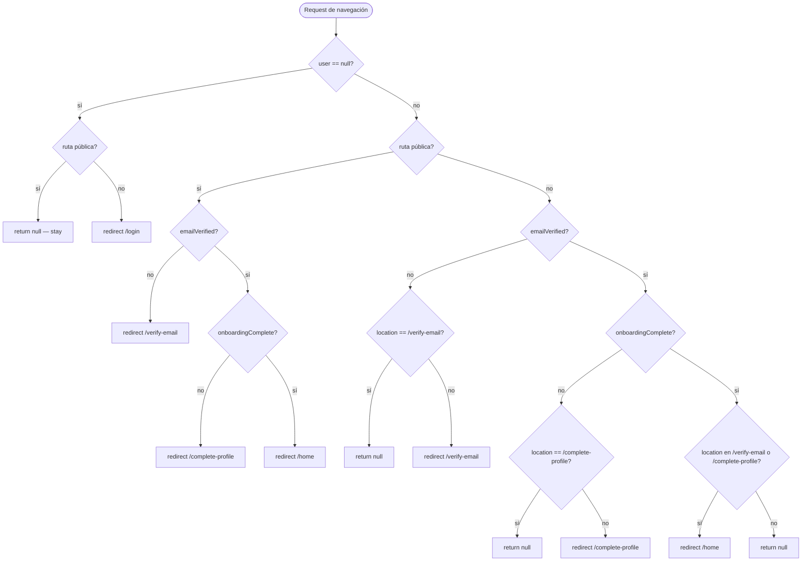
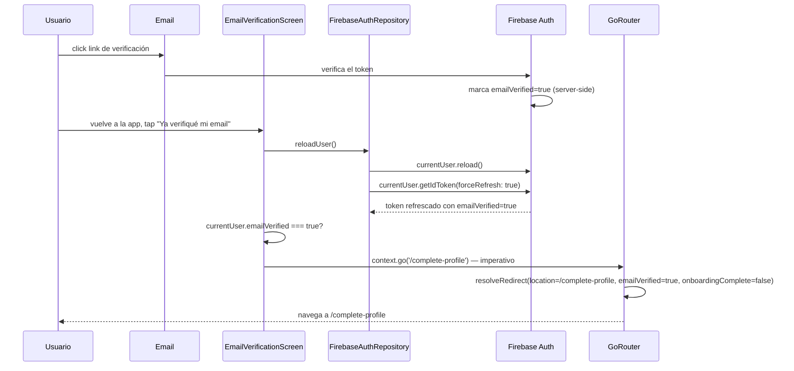
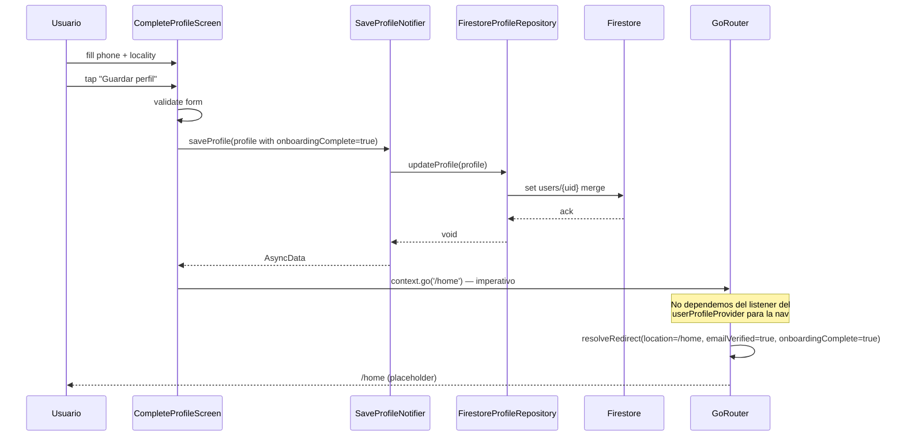
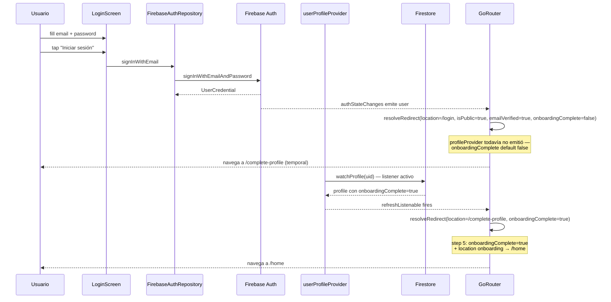
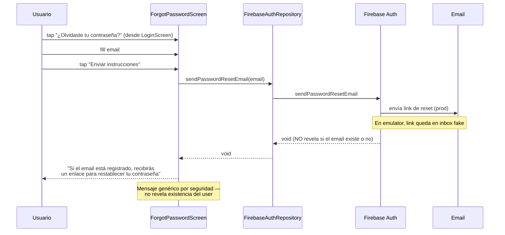
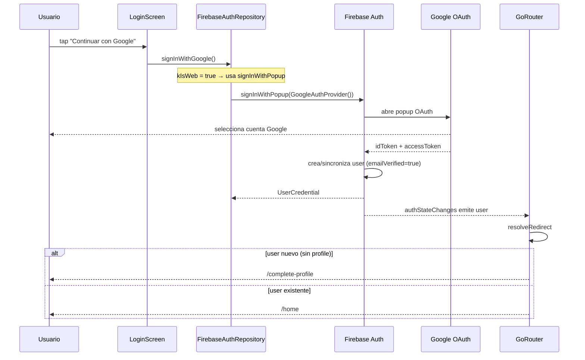
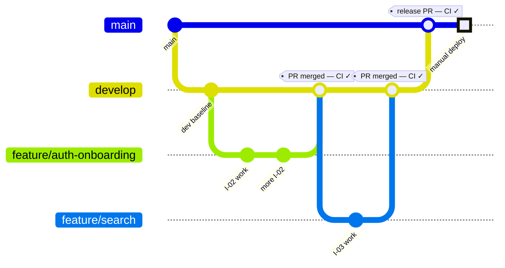

# ChangaYa — Arquitectura del Sistema

> **Propósito de este documento:** describir el estado **real implementado** del
> sistema ChangaYa. No es aspiracional — lo que está acá es lo que hay en el
> código, los tests y los entornos hoy.
>
> **Cómo leer este documento:**
> - Si buscás **qué hace el producto** (requirements) → ver [`PRD.md`](00-project-init/PRD.md)
> - Si buscás **por qué se decidió algo** (trade-offs) → ver [`RFC.md`](00-project-init/RFC.md) (ADRs)
> - Si buscás **cómo funciona algo que está construido** → seguí leyendo
> - Si te encontraste con un bug o error raro → ver [`troubleshooting.md`](troubleshooting.md)
>
> **Actualización:** este documento se actualiza con cada incremento (I-XX)
> que se completa. Ver [Sección 12 — Cómo extender este documento](#12-cómo-extender-este-documento).

---

## Tabla de Contenidos

- [1. Visión general](#1-visión-general)
- [2. Quick Reference — stack y comandos](#2-quick-reference)
- [3. Estructura del proyecto](#3-estructura-del-proyecto)
- [4. Principios arquitectónicos](#4-principios-arquitectónicos)
- [5. State management (Riverpod)](#5-state-management-riverpod)
- [6. Navegación (GoRouter)](#6-navegación-gorouter)
- [7. Entornos](#7-entornos)
- [8. Integración con Firebase](#8-integración-con-firebase)
- [9. Features implementadas (incrementos)](#9-features-implementadas)
  - [9.1 I-02 — Auth + Onboarding del cliente](#91-i-02--auth--onboarding-del-cliente)
- [10. Estrategia de testing](#10-estrategia-de-testing)
- [11. Limitaciones conocidas y tech debt](#11-limitaciones-conocidas-y-tech-debt)
- [12. CI/CD y Deployment](#12-cicd-y-deployment)
- [13. Cómo extender este documento](#13-cómo-extender-este-documento)

---

## 1. Visión general

**ChangaYa** es un marketplace two-sided de servicios locales para la provincia
de Formosa, Argentina. Conecta clientes que buscan prestadores de oficios con
profesionales que ofrecen sus servicios. Modelo freemium basado en visibilidad
(no en límites funcionales — ver [RFC § ADR-03](00-project-init/RFC.md)).

### Estado actual de la implementación

| Área | Estado |
|------|--------|
| Setup inicial del proyecto | ✅ Completo (I-01) |
| Auth + Onboarding del cliente | ✅ Completo (I-02) |
| Search & Discovery de prestadores | ⏳ Próximo incremento |
| Solicitudes de servicio | ⏳ Pendiente |
| Mensajería contextual | ⏳ Pendiente |
| Reviews | ⏳ Pendiente |
| Notificaciones FCM | ⏳ Pendiente |
| Freemium / Suscripciones | ⏳ Pendiente |
| Admin dashboard | ⏳ Pendiente |

**Tipo de producto:** marketplace multi-plataforma
**Alcance v1:** Android (primario), iOS, Web (admin panel)
**Región:** Formosa, Argentina (`southamerica-east1`)

---

## 2. Quick Reference

### Stack

| Capa | Tecnología | Versión |
|------|-----------|---------|
| Framework | Flutter | 3.x stable |
| Lenguaje | Dart | 3.x |
| Estado | Riverpod + riverpod_annotation | 3.3.1 / 4.0.3 |
| Navegación | GoRouter | 17.x |
| Backend | Firebase (Auth, Firestore, Storage, Functions, Messaging, Analytics, Crashlytics, Performance) | latest stable |
| Cloud Functions | Node.js 20 + TypeScript + Firebase Functions v2 | — |
| Unit/Widget tests | flutter_test + mockito | — |
| Integration tests | integration_test + Firebase Emulator Suite | — |
| E2E web | Playwright | 1.59.1 |

**Paquetes explícitamente excluidos:** `http`, `dio`, `GetX`, `Hive`, `Isar`, `BLoC/flutter_bloc`, `google_maps_flutter` (ver [`lib/CLAUDE.md`](../lib/CLAUDE.md)).

### Comandos de uso frecuente

```bash
# Desarrollo — contra emuladores Firebase locales
firebase emulators:start --only auth,firestore,storage,functions
flutter run -t lib/main_dev.dart -d <device>

# Tests unit + widget
flutter test

# Integration tests (requiere emuladores corriendo)
flutter test integration_test/

# E2E web (requiere flutter web corriendo en :5050)
flutter run -t lib/main_dev.dart -d chrome --web-port=5050
node e2e/auth_flow_test.js            # flow #1 registro
node e2e/login_existing_test.js       # flow #2 login
node e2e/password_reset_test.js       # flow #3 reset
node e2e/google_signin_test.js        # google sign-in

# Análisis
flutter analyze

# Producción
flutter build apk --release -t lib/main_prod.dart
flutter build web --release -t lib/main_prod.dart
```

### Entry points

| Archivo | Propósito |
|---------|-----------|
| `lib/main.dart` | Entry genérico (no usado directamente) |
| `lib/main_dev.dart` | Dev — conecta a Firebase Emulator Suite |
| `lib/main_prod.dart` | Producción — Firebase real |
| `lib/main_staging.dart` | ⏳ Pendiente — Firebase staging real |

La diferencia entre entry points se limita a la inicialización de Firebase
(conectar o no a emuladores). Toda la lógica de la app vive en `AppRoot` y
es compartida — ver [Sección 7 — Entornos](#7-entornos).

---

## 3. Estructura del proyecto

```
ChangaYa/
├── lib/                              # Código Flutter (cliente)
│   ├── main.dart
│   ├── main_dev.dart                 # entry: conecta emuladores
│   ├── main_prod.dart                # entry: Firebase real
│   ├── firebase_options.dart         # config generada por FlutterFire CLI
│   ├── app/                          # composición raíz de la app
│   │   ├── app.dart                  # AppRoot (MaterialApp.router)
│   │   ├── routes.dart               # GoRouter + resolveRedirect
│   │   └── theme.dart                # Material 3 light/dark
│   ├── core/                         # transversal (no feature-specific)
│   │   ├── constants/
│   │   ├── errors/
│   │   ├── utils/
│   │   └── widgets/                  # LoadingButton, error_snackbar, etc.
│   ├── features/                     # un módulo por feature
│   │   ├── auth/                     # ✅ I-02 implementado
│   │   │   ├── data/                 # FirebaseAuthRepository, mappers
│   │   │   ├── domain/               # User, AuthRepository, AuthFailure
│   │   │   └── presentation/         # screens + providers
│   │   ├── profile/                  # ✅ I-02 implementado
│   │   │   ├── data/
│   │   │   ├── domain/
│   │   │   └── presentation/
│   │   ├── search/                   # ⏳ scaffolded
│   │   ├── service_request/          # ⏳ scaffolded
│   │   ├── reviews/                  # ⏳ scaffolded
│   │   ├── notifications/            # ⏳ scaffolded
│   │   ├── subscription/             # ⏳ scaffolded
│   │   └── admin/                    # ⏳ scaffolded
│   └── services/                     # wrappers Firebase (Firestore, Storage, FCM)
│
├── functions/                        # Cloud Functions backend (TypeScript)
│   ├── src/
│   │   ├── index.ts                  # export de todas las funciones
│   │   └── auth/                     # triggers relacionados a auth
│   ├── package.json
│   └── tsconfig.json
│
├── android/                          # Host nativo Android (Gradle)
│   └── app/src/
│       ├── main/AndroidManifest.xml
│       ├── debug/AndroidManifest.xml # cleartext permitido (ver troubleshooting)
│       └── profile/
│
├── ios/                              # Host nativo iOS (Xcode)
│
├── test/                             # Unit + widget tests
│   ├── app/                          # tests del routing (resolveRedirect)
│   └── features/                     # tests por feature (mirror de lib/features/)
│
├── integration_test/                 # Integration tests Flutter (Dart)
│   ├── auth_flow_test.dart           # flow #1 scaffold + impl
│   └── helpers/
│       └── auth_emulator_rest.dart   # REST contra Auth Emulator
│
├── e2e/                              # E2E web (Playwright)
│   ├── auth_flow_test.js             # flow #1 registro
│   ├── login_existing_test.js        # flow #2 login
│   ├── password_reset_test.js        # flow #3 reset
│   ├── google_signin_test.js         # Google Sign-In popup
│   └── screenshots/                  # capturas de cada paso
│
├── openspec/                         # SDD (Spec-Driven Development)
│   └── changes/                      # changes implementados / en curso
│
├── docs/                             # Documentación
│   ├── ARCHITECTURE.md               # este archivo
│   ├── troubleshooting.md            # log de bugs encontrados y fixes
│   └── 00-project-init/              # artefactos del setup inicial
│       ├── context.md
│       ├── PRD.md                    # requirements del producto
│       └── RFC.md                    # diseño técnico + ADRs
│
├── firebase.json                     # config de emuladores + deploy
├── firestore.rules                   # reglas de seguridad Firestore
├── firestore.indexes.json            # índices compuestos
├── storage.rules                     # reglas de seguridad Storage
├── pubspec.yaml                      # deps Flutter
├── package.json                      # deps Node (E2E Playwright)
└── CLAUDE.md                         # instrucciones para agentes IA (raíz)
```

---

## 4. Principios arquitectónicos

### 4.1 Clean Architecture por feature

Cada feature (`lib/features/<feature>/`) se organiza en tres capas con dependencia
**unidireccional**: `presentation → domain ← data`.

```
┌─────────────────────────────────────────┐
│  presentation/  (UI + providers)        │
│  - Screens                              │
│  - Widgets                              │
│  - Riverpod providers                   │
└────────────────┬────────────────────────┘
                 │ depende de
                 ▼
┌─────────────────────────────────────────┐
│  domain/  (entidades + contratos)       │
│  - Entidades (User, UserProfile)        │
│  - Interfaces (AuthRepository)          │
│  - Failures                             │
└─────────────────────────────────────────┘
                 ▲
                 │ implementa
┌────────────────┴────────────────────────┐
│  data/  (infra + mapeo)                 │
│  - FirebaseAuthRepository               │
│  - Models + mappers                     │
└─────────────────────────────────────────┘
```

**Reglas clave:**

- `domain/` NO importa Firebase ni paquetes de infra. Son entidades puras + contratos.
- `data/` es el ÚNICO que importa Firebase. Implementa los contratos de `domain/`.
- `presentation/` consume providers que exponen el dominio — nunca llama a Firebase directamente.
- Los providers Riverpod en `presentation/` llaman al repositorio (interfaz de dominio), no a la implementación concreta.

**Ejemplo concreto (auth):**

```
lib/features/auth/
├── data/
│   ├── firebase_auth_repository.dart       # implements AuthRepository
│   └── firebase_user_mapper.dart           # fb.User → domain User
├── domain/
│   ├── auth_repository.dart                # abstract class (contrato)
│   ├── user.dart                           # entidad inmutable
│   └── auth_failure.dart                   # sealed failures
└── presentation/
    ├── screens/                            # login, register, verify, forgot
    └── providers/
        ├── auth_providers.dart             # Riverpod providers
        └── email_verification_notifier.dart
```

### 4.2 Naming y conventions

- **Dart/Flutter:** nombres en inglés para código, comentarios en español solo cuando aclaran lógica de negocio no obvia.
- **TypeScript (functions):** ESLint `@typescript-eslint/recommended`, `strict: true`, sin `any` explícito.
- **Commits:** Conventional Commits. Sin atribuciones de IA.
- **Branches:** `main` = prod, `develop` = integración, `feature/[slug]`, `fix/[slug]`.
- **Tests:** `should_[comportamiento]_when_[condición]`.

### 4.3 Reglas de seguridad no-negociables (ver [`CLAUDE.md`](../CLAUDE.md) § Security)

1. Webhook Mercado Pago valida firma HMAC-SHA256.
2. Asignación de rol `provider` vía Cloud Function con verificación `uid caller == uid documento`, log en `admin_log/`.
3. Uploads: tipos `image/jpeg|png|webp`, max 5MB, header `Content-Disposition: attachment`.
4. Rate limiting mensajes: 10/min por usuario.
5. Verificación de suspensión **server-side** en operaciones sensibles.
6. Límites de plan: **exclusivamente en Cloud Functions**, nunca cliente.

---

## 5. State management (Riverpod)

**Versión:** `flutter_riverpod` 3.3.1 + `riverpod_annotation` 4.0.3 (code generation via `riverpod_generator` 4.0.3).

### 5.1 Reglas de scope

| Scope | Annotation | Uso |
|-------|-----------|-----|
| Global (persiste durante toda la sesión) | `@Riverpod(keepAlive: true)` | Sesión, rol, plan, repositorios |
| Local de feature | `@riverpod` (autoDispose por default) | Estado de una pantalla/flow específico |

### 5.2 Los providers no tocan Firebase directamente

Siempre pasan por el repositorio (contrato del dominio). Ejemplo:

```dart
// lib/features/auth/presentation/providers/auth_providers.dart
@Riverpod(keepAlive: true)
AuthRepository authRepository(Ref ref) {
  return FirebaseAuthRepository(
    firebaseAuth: FirebaseAuth.instance,
    googleSignIn: GoogleSignIn(),
  );
}

@Riverpod(keepAlive: true)
Stream<User?> authStateChanges(Ref ref) {
  return ref.watch(authRepositoryProvider).authStateChanges;
}
```

`authStateChanges` expone el `Stream<User?>` del repositorio. El resto de la app
lo consume via `ref.watch(authStateChangesProvider)`.

### 5.3 Generación de código

Los archivos `*.g.dart` (generados) se regeneran con:

```bash
dart run build_runner build --delete-conflicting-outputs
```

**Nunca editar `*.g.dart` manualmente.**

---

## 6. Navegación (GoRouter)

**Versión:** `go_router` 17.x. Toda la navegación centralizada en [`lib/app/routes.dart`](../lib/app/routes.dart).

### 6.1 Rutas definidas

| Path | Screen | Público |
|------|--------|---------|
| `/login` | `LoginScreen` | ✅ |
| `/register` | `RegisterScreen` | ✅ |
| `/forgot-password` | `ForgotPasswordScreen` | ✅ |
| `/verify-email` | `EmailVerificationScreen` | ❌ (requiere auth) |
| `/complete-profile` | `CompleteProfileScreen` | ❌ (requiere auth + emailVerified) |
| `/home` | placeholder actualmente | ❌ (requiere auth + emailVerified + onboardingComplete) |

Las rutas públicas están definidas en `_publicRoutes` en `routes.dart`.

### 6.2 Guard chain — `resolveRedirect`

La función pura `resolveRedirect` es la **fuente de verdad de autorización**.
Es exportada para ser unit-testeable (ver [ADR-D02](../openspec/changes/auth-onboarding/design.md)) y cubre 6 casos en cascada:



### 6.3 Patrón híbrido: declarativo + imperativo

Para **cambios de estado globales** (login, logout, token expiry) → declarativo
(GoRouter redirect observa el estado y navega automáticamente).

Para **acciones explícitas del usuario** (save profile, verify email done) →
imperativo (`context.go(...)` directo).

**Por qué:** el modelo declarativo puro es frágil cuando depende de streams —
la UX se siente colgada si el stream tarda. El imperativo es instantáneo y
explícito. Toda app de producción seria usa este patrón híbrido.

Casos actuales de nav imperativa:
- `CompleteProfileScreen` tras save exitoso → `context.go('/home')`
- `EmailVerificationScreen` tras reload + verified=true → `context.go('/complete-profile')`

Ver [troubleshooting.md — "Guardar perfil no navega"](troubleshooting.md) y
[troubleshooting.md — "Ya verifiqué mi email no navega"](troubleshooting.md).

### 6.4 Refresh del redirect — `AuthChangeNotifier`

GoRouter re-evalúa `redirect` cuando `refreshListenable` notifica. El puente
Riverpod → GoRouter está en `AuthChangeNotifier`:

```dart
class AuthChangeNotifier extends ChangeNotifier {
  AuthChangeNotifier(this._ref) {
    _ref.listen(authStateChangesProvider, (_, __) => notifyListeners());
    _ref.listen(userProfileProvider, (_, __) => notifyListeners());
  }
  final WidgetRef _ref;
}
```

Cuando el auth state o el profile cambian, el notifier dispara → GoRouter
re-corre el redirect. Este es el mecanismo que permite que la navegación
reaccione a cambios de estado automáticamente.

---

## 7. Entornos

| Entorno | Entry point | Infra |
|---------|-------------|-------|
| **Desarrollo** | `lib/main_dev.dart` | Firebase Emulator Suite local |
| **Staging** | `lib/main_staging.dart` (⏳ pendiente) | Firebase project `changaya-staging` |
| **Producción** | `lib/main_prod.dart` | Firebase project `changaya-prod` |

### 7.1 La app es la misma, solo cambia la puerta de entrada

Los entry points son **minúsculos** y solo se ocupan de inicializar Firebase.
Toda la lógica de feature vive en `AppRoot` (`lib/app/app.dart`) y es
compartida entre entornos.

Diferencia real entre `main_dev.dart` y `main_prod.dart`:

```dart
// main_dev.dart
await FirebaseAuth.instance.useAuthEmulator(emulatorHost, 9099);
FirebaseFirestore.instance.useFirestoreEmulator(emulatorHost, 8080);
await FirebaseStorage.instance.useStorageEmulator(emulatorHost, 9199);

// main_prod.dart
// (nada — Firebase apunta a los servidores reales por default)
```

### 7.2 Host para emuladores (detección por plataforma)

Android emulator usa `10.0.2.2` como alias al host Mac; web/iOS/desktop usan
`localhost`. La función `_emulatorHost()` en `main_dev.dart` detecta la
plataforma en runtime:

```dart
String _emulatorHost() {
  if (kIsWeb) return 'localhost';
  if (Platform.isAndroid) return '10.0.2.2';
  return 'localhost';
}
```

Ver [troubleshooting.md — "Error inesperado" Android](troubleshooting.md).

---

## 8. Integración con Firebase

### 8.1 Servicios usados

| Servicio | Uso actual |
|----------|-----------|
| Firebase Auth | ✅ email/password + Google OAuth |
| Cloud Firestore | ✅ persistencia de profile |
| Firebase Storage | ✅ interfaz ready (upload foto pendiente) |
| Cloud Functions | ⏳ scaffolded, sin funciones reales todavía |
| Firebase Messaging (FCM) | ⏳ pendiente |
| Firebase Analytics | ⏳ pendiente |
| Firebase Crashlytics | ⏳ pendiente (inicializado pero sin eventos custom) |
| Firebase Performance | ⏳ pendiente |

### 8.2 Firebase Auth — streams y cuándo usar cada uno

Firebase Auth expone tres streams con semántica distinta. Esta distinción es
crítica para reaccionar correctamente a cambios:

| Stream | Emite en |
|--------|----------|
| `authStateChanges()` | Solo sign-in / sign-out |
| `idTokenChanges()` | Lo anterior + refresh de token |
| `userChanges()` | Lo anterior + cambios en propiedades del user (`emailVerified`, `displayName`, etc.) |

**En ChangaYa** usamos `userChanges()` en `FirebaseAuthRepository.authStateChanges`
porque necesitamos reaccionar al cambio de `emailVerified` tras `reloadUser()`.
Ver [troubleshooting.md — userChanges vs authStateChanges](troubleshooting.md).

### 8.3 Auth quirk: reload + token refresh

`currentUser.reload()` refresca metadatos del user **pero no el ID token**. El
campo `emailVerified` vive en el token, no en los metadatos. Por eso en
`reloadUser()` llamamos a los dos:

```dart
Future<void> reloadUser() async {
  await _firebaseAuth.currentUser?.reload();
  await _firebaseAuth.currentUser?.getIdToken(true); // force refresh
}
```

Ver [troubleshooting.md — doble tap en "Ya verifiqué mi email"](troubleshooting.md).

### 8.4 Reglas de seguridad — `firestore.rules`

Documentado completo en [`firestore.rules`](../firestore.rules). Highlights:

- `users/{uid}` — read si autenticado, write si owner o admin.
- `providers/{uid}` — read público (para search), write con protected fields.
- `service_requests/{requestId}` — solo participantes (client + provider + admin).
- `reviews/{reviewId}` — read público, write solo creator.
- Campos protegidos (`rating`, `plan`, `isVerified`, `completionPercentage`, etc.) — solo vía Admin SDK (Cloud Functions).

---

## 9. Features implementadas

### 9.1 I-02 — Auth + Onboarding del cliente

**Estado:** ✅ Archivado (2026-04-13) con 163/163 tests pasando + validación manual en Android emulator y Playwright web.

**Artefactos SDD:** [`openspec/changes/auth-onboarding/`](../openspec/changes/auth-onboarding/) (proposal, spec, design, tasks, verify, archive).

#### 9.1.1 Scope

Flujos cubiertos:
- Registro con email/password
- Registro con Google OAuth (funciona en web; en Android requiere config adicional de SHA-1 — ver tech debt)
- Login email/password
- Login Google OAuth
- Password reset (con mensaje genérico no-revelador)
- Email verification (real en prod, simulada vía REST en dev — ver [Sección 10 — testing](#10-estrategia-de-testing))
- Onboarding: completar teléfono + localidad (foto opcional, ⏳ tech debt)

#### 9.1.2 Data model — `users/{uid}` (Firestore)

```
users/{uid}
├── uid: string
├── displayName: string
├── phone: string? (normalizado — solo dígitos, 10–11 chars)
├── locality: string? (enum: 15 localidades de Formosa)
├── photoURL: string? (URL de Firebase Storage)
├── onboardingComplete: bool
└── updatedAt: timestamp
```

Modelo de datos: [`lib/features/profile/data/user_profile_model.dart`](../lib/features/profile/data/user_profile_model.dart).
Entidad de dominio: [`lib/features/profile/domain/user_profile.dart`](../lib/features/profile/domain/user_profile.dart).

#### 9.1.3 Sequence diagram — Registro (email + password)

```mermaid
sequenceDiagram
    participant U as Usuario
    participant R as RegisterScreen
    participant Repo as FirebaseAuthRepository
    participant FB as Firebase Auth
    participant GR as GoRouter

    U->>R: fill name/email/password/confirm + accept terms
    U->>R: tap "Crear cuenta"
    R->>R: validate form + terms
    R->>Repo: registerWithEmail(email, password, name)
    Repo->>FB: createUserWithEmailAndPassword
    FB-->>Repo: UserCredential (emailVerified: false)
    Repo->>FB: updateDisplayName(name)
    Repo-->>R: User
    FB-->>GR: authStateChanges emite nuevo user
    GR->>GR: resolveRedirect(location=/register, isPublic=true, emailVerified=false)
    GR-->>U: navega a /verify-email
    Note over FB: Firebase envía email de verificación<br/>(en prod; en emulator queda en inbox fake)
```

#### 9.1.4 Sequence diagram — Verificación de email



#### 9.1.5 Sequence diagram — Completar perfil (onboarding)



#### 9.1.6 Sequence diagram — Login existente



**Nota crítica:** sin el step 5 del redirect (agregado en 2026-04-14), el user
se quedaba atascado en /complete-profile. Ver
[troubleshooting.md — "Usuario atascado"](troubleshooting.md).

#### 9.1.7 Sequence diagram — Password reset



#### 9.1.8 Sequence diagram — Google Sign-In (web)



**En Android/iOS** el flow es diferente — usa `google_sign_in` package nativo
en vez de `signInWithPopup`. Ver `FirebaseAuthRepository.signInWithGoogle()`.

#### 9.1.9 Pantallas e interfaces clave (I-02)

| Archivo | Función |
|---------|---------|
| `lib/features/auth/presentation/screens/login_screen.dart` | Login email/password + Google |
| `lib/features/auth/presentation/screens/register_screen.dart` | Registro email/password + Google |
| `lib/features/auth/presentation/screens/email_verification_screen.dart` | Instrucciones + "Ya verifiqué" |
| `lib/features/auth/presentation/screens/forgot_password_screen.dart` | Solicitar reset email |
| `lib/features/profile/presentation/screens/complete_profile_screen.dart` | Onboarding: teléfono + localidad |

Widget keys exportadas para testing:
- `RegisterScreen`: `registerNameFieldKey`, `registerEmailFieldKey`, `registerPasswordFieldKey`, `registerConfirmPasswordFieldKey`, `registerSubmitButtonKey`
- `LoginScreen`: `loginEmailFieldKey`, `loginPasswordFieldKey`, `loginSubmitButtonKey`
- `CompleteProfileScreen`: `completeProfilePhoneFieldKey`

#### 9.1.10 Coverage de tests (I-02)

| Capa | Archivos | Tests |
|------|----------|-------|
| Domain (entities, failures) | `test/features/auth/domain/`, `test/features/profile/domain/` | 45+ |
| Data (repositorios) | `test/features/auth/data/firebase_auth_repository_test.dart` | 19 |
| Presentation (widgets) | `test/features/auth/presentation/*.dart`, `test/features/profile/presentation/*.dart` | 100+ |
| Routing | `test/app/resolve_redirect_test.dart` | 12 |
| **Total unit + widget** | | **164** |
| Integration (flow completo) | `integration_test/auth_flow_test.dart` | 1 impl + 2 scaffold |
| E2E web (Playwright) | `e2e/*.js` | 4 flows |

---

## 10. Estrategia de testing

### 10.1 Pirámide

```
        ▲
       ╱ ╲
      ╱E2E╲              10% — Playwright (web) + integration_test (mobile)
     ╱─────╲
    ╱ Integ ╲            20% — Firebase Emulator Suite
   ╱─────────╲
  ╱   Unit    ╲           70% — flutter_test + mockito
 ╱─────────────╲
```

### 10.2 Aislamiento por capa

| Capa | Tipo | Herramienta | Mockea |
|------|------|-------------|--------|
| `domain/` | Unit | flutter_test | Nada (puras) |
| `data/` | Unit con mocks | flutter_test + mockito | Firebase SDK |
| `presentation/` | Widget | flutter_test + mockito | Repositorio (contrato del dominio) |
| `app/` (routing) | Unit pura | flutter_test | Nada (función pura) |
| Integration | Integration | integration_test + Firebase Emulator | Nada (infra real local) |
| E2E web | E2E | Playwright + Firebase Emulator | Nada |

### 10.3 Mockear profile vs usar emulator

- **Unit + widget tests:** mockean el repositorio del dominio. No hablan con Firebase.
- **Integration tests (Dart):** hablan con Firebase Emulator Suite. Usan el helper [`integration_test/helpers/auth_emulator_rest.dart`](../integration_test/helpers/auth_emulator_rest.dart) para operaciones que requieren privilegios de admin (marcar emailVerified, limpiar users).
- **E2E web (Playwright):** lanzan Chrome real contra la app Flutter web servida en `localhost:5050`, que a su vez conecta al emulador Firebase.

### 10.4 Email verification en tests

El Firebase Auth Emulator **no envía emails reales**. Para simular que el
usuario verificó su email, usamos la REST API del emulator:

```
POST http://127.0.0.1:9099/identitytoolkit.googleapis.com/v1/projects/{p}/accounts:update
Authorization: Bearer owner
Body: { "localId": "<uid>", "emailVerified": true }
```

Este endpoint solo existe en el emulador (no en Firebase real). El equivalente
en prod es el user clickeando el link del email. Ambos paths convergen en
"user.emailVerified = true" — la app no los distingue.

### 10.5 Testing manual

Aun con todos los automated tests, testing manual sigue siendo crítico:

- **Encontró 4 bugs reales que iban a producción** durante la validación del I-02 que ningún unit test detectaba (userChanges, token refresh, redirect cascade, redirect stuck).
- Flows de UX (flashes, responsiveness) no se detectan con unit/widget tests — requieren ojo humano.
- Recomendación: testing manual **post-implementation** contra emuladores + staging, antes del PR.

---

## 11. Limitaciones conocidas y tech debt

Ver también [`troubleshooting.md`](troubleshooting.md) para bugs resueltos y sus explicaciones.

### 11.1 Bugs conocidos no resueltos (documentados)

| Bug | Entorno | Severidad | Workaround |
|-----|---------|-----------|------------|
| Firestore snapshot listeners flaky | Solo Android emulator | Baja (dev only) | Cerrar + reabrir la app; usar imperative nav en screens críticos |
| Google Sign-In falla | Solo Android emulator | Media | Diferido a staging con SHA-1 configurado |

### 11.2 Tech debt registrado

| Item | Archivo/área | Prioridad | Memoria engram |
|------|--------------|-----------|----------------|
| Photo picker en CompleteProfileScreen | `lib/features/profile/presentation/screens/complete_profile_screen.dart` | Baja | `techdebt/profile-photo-upload` |
| Setup `main_staging.dart` + Firebase staging project | `lib/main_staging.dart` (no existe) | Media | — |
| Migrar scripts E2E a `npx playwright test` runner | `e2e/*.js` | Baja | — |
| Reemplazar click por coordenadas del dropdown en E2E | `e2e/auth_flow_test.js` | Baja | — |
| Toggle de theme light/dark manual en settings | `lib/app/app.dart` | Baja | — (tech debt nuevo) |
| Placeholder de `/home` — implementar home real | `lib/app/routes.dart:148` | Alta (próximo incremento) | — |

### 11.3 Decisiones aplazadas

- Verificación de identidad con documento (RF-12) — pendiente a feature post-v1.
- Suscripción / pagos con Mercado Pago — pendiente.
- Cloud Functions reales (solo scaffold) — se implementarán cuando algún feature las requiera.

---

## 12. CI/CD y Deployment

El proyecto usa **GitHub Actions** para integración continua y deployment
automatizado a Firebase. Los workflows viven en `.github/workflows/`.

### 12.1 CI — `.github/workflows/ci.yml`

**Trigger:**
- Pull Request hacia `main` o `develop`
- Push a `develop`

**Jobs** (ejecutados en `ubuntu-latest`):

| Job | Dependencia | Qué hace |
|-----|-------------|----------|
| `flutter-analyze` | — | `flutter analyze --fatal-infos` + `dart format --output=none --set-exit-if-changed .` |
| `flutter-test` | flutter-analyze | `flutter test --coverage` + upload a Codecov |
| `functions-lint` | — | Cloud Functions: `npm ci`, `npm run lint`, `npm run build` (TypeScript compile) |

`flutter-test` corre solo si `flutter-analyze` pasa (gate explícito).
`functions-lint` corre en paralelo porque no depende del código Flutter.

**Herramientas usadas en CI:**
- `subosito/flutter-action@v2` — Flutter con cache.
- `actions/setup-node@v4` — Node 20 con cache de npm.
- `codecov/codecov-action@v4` — reporte de coverage.

### 12.2 Deploy — `.github/workflows/deploy.yml`

**Trigger:** `workflow_dispatch` — manual desde la UI de GitHub Actions.

**Motivo del disparo manual:** permite decidir cuándo promover cambios a
producción. En el futuro se puede migrar a disparo automático en push a `main`
cuando haya confianza en la pipeline end-to-end (tech debt — ver [Sección 11](#11-limitaciones-conocidas-y-tech-debt)).

**Pasos del pipeline:**

1. Checkout del código
2. Setup Node 20 + cache npm
3. Install y build de Cloud Functions (`functions/` → TypeScript → `functions/lib/`)
4. Setup Flutter + cache
5. `flutter pub get`
6. `flutter build web --release -t lib/main_prod.dart` — build del admin panel web
7. Deploy a Firebase Hosting (canal `live`) vía `FirebaseExtended/action-hosting-deploy@v0`
8. Deploy Functions + Firestore rules + Storage rules vía `firebase-tools`

**Environment:** `production` — GitHub environment que permite requerir
approval manual y restringir qué ramas pueden triggerear.

**Secretos requeridos** (en GitHub repo settings → Environments → production):
- `FIREBASE_SERVICE_ACCOUNT_PROD` — JSON del service account de Firebase para hosting.
- `FIREBASE_PROJECT_ID_PROD` — ID del proyecto Firebase de producción.
- `FIREBASE_TOKEN` — token de `firebase-tools` (generado con `firebase login:ci`) para deploy de functions/rules.

**Nota:** al día de hoy el proyecto Firebase de producción todavía no está
creado — el deploy se puede ejecutar pero fallará hasta que se configure
`changaya-prod`. El `deploy.yml` está listo para cuando ese proyecto exista.

### 12.3 Branch protection (GitHub rulesets)

Configurados en `GomezFabricio/ChangaYa`:

| Ruleset | ID | Aplica a | Reglas |
|---------|-----|----------|--------|
| `develop-protection` | 14978254 | `refs/heads/develop` | no delete, no force push, CI obligatorio (3 checks) |
| `main-protection` | 14978089 | `refs/heads/main` | no delete, no force push, CI obligatorio, PR required |

**Los 3 checks obligatorios** son los jobs definidos en `ci.yml`:
`flutter-analyze`, `flutter-test`, `functions-lint`. Sin los tres en verde no
se puede mergear.

### 12.4 Flujo de trabajo



- **`develop`** es la rama de integración. Todo feature parte de `develop` como `feature/[slug]` o `fix/[slug]`.
- **`main`** es producción. Solo se mergea desde `develop` vía PR.
- El deploy **NO se dispara automáticamente** en merge a `main` — se corre manualmente desde la UI de GitHub Actions cuando se decide promover.
- **CI es bloqueante**: cada PR debe pasar los 3 jobs antes de poder mergear.

### 12.5 Comandos locales equivalentes

Para reproducir el CI localmente antes de pushear:

```bash
# Equivalente a flutter-analyze
flutter analyze --fatal-infos
dart format --output=none --set-exit-if-changed .

# Equivalente a flutter-test
flutter test --coverage

# Equivalente a functions-lint
cd functions && npm ci && npm run lint && npm run build
```

Si todos estos pasan localmente, el CI pasa. Ejecutarlos pre-push evita el
ping-pong de "arreglar warnings en CI".

### 12.6 Limitaciones actuales

- **No hay deploy automático a staging** — el entorno staging no está configurado todavía (ver [Sección 11 — tech debt](#11-limitaciones-conocidas-y-tech-debt)).
- **No hay tests E2E en CI** — los E2E Playwright corren solo localmente contra emuladores. Migrar a CI requiere levantar emuladores Firebase en GitHub Actions (factible con `firebase emulators:exec` pero no implementado).
- **No hay deploy de app mobile en el pipeline** — solo se buildea Flutter Web. El APK/IPA se genera manualmente cuando toque distribuir la app.
- **Coverage thresholds no enforced** — el upload a Codecov tiene `fail_ci_if_error: false` y no hay reglas de % mínimo. Cuando la suite madure, considerar enforce.

---

## 13. Cómo extender este documento

Cuando se completa un nuevo incremento (I-XX), agregar:

### 13.1 En la [Sección 1 — Visión general](#1-visión-general)

Actualizar la tabla "Estado actual de la implementación" marcando el feature
como ✅ Completo.

### 13.2 En la [Sección 9 — Features implementadas](#9-features-implementadas)

Agregar una nueva subsección `## 9.X I-XX — [Nombre del incremento]` con:

1. **Estado** (fecha de archive, tests pasando, validaciones).
2. **Link a artefactos SDD** (`openspec/changes/XXX/`).
3. **Scope** — qué flujos/features cubre.
4. **Data model** — schema de Firestore / Storage afectados.
5. **Sequence diagrams** (Mermaid) — al menos uno por flow crítico.
6. **Pantallas/interfaces clave** — tabla de archivos con función.
7. **Coverage de tests** — tabla con conteo por capa.

### 13.3 En otras secciones (si aplica)

- **Sección 2 — Quick Reference:** si hay nuevos comandos o entry points.
- **Sección 3 — Estructura del proyecto:** marcar features implementados.
- **Sección 6 — Navegación:** si hay nuevas rutas, actualizar la tabla y el diagrama del guard chain.
- **Sección 8 — Firebase:** si se usan nuevos servicios (Functions, Messaging, etc.).
- **Sección 11 — Limitaciones y tech debt:** mover items resueltos, agregar nuevos.
- **Sección 12 — CI/CD y Deployment:** si se agregan jobs, ambientes, o secretos.

### 13.4 Workflow sugerido

```
1. Al archivar un change (/sdd-archive), ejecutar también:
   - Actualizar ARCHITECTURE.md siguiendo esta sección 13
   - Agregar entrada en troubleshooting.md si hubo bugs interesantes
   - mem_save en engram con topic_key distintivo
2. Commit que incluya ARCHITECTURE.md junto al archive del change.
```

### 13.5 Convenciones de diagramas

- Usar **Mermaid** (GitHub renderiza nativo).
- Tipos preferidos: `sequenceDiagram` para flows, `flowchart` para lógica condicional, `erDiagram` para schemas complejos, `gitGraph` para flujos de branches.
- Mantener nombres consistentes: `U` = Usuario, `GR` = GoRouter, `Repo` = Repositorio, `FB` = Firebase Auth, `FS` = Firestore.

---

**Última actualización:** 2026-04-14 — agregada Sección 12 (CI/CD y Deployment) con workflows `ci.yml` y `deploy.yml`, branch protection rulesets, y diagrama de flujo Git.
